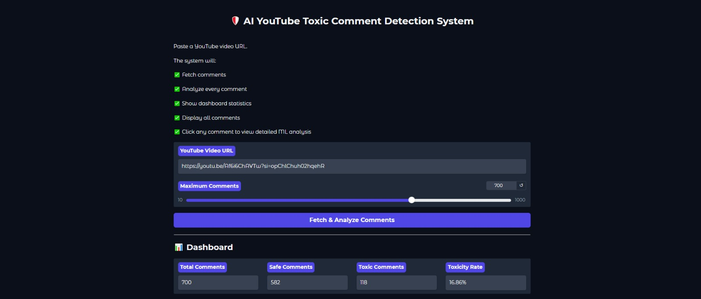
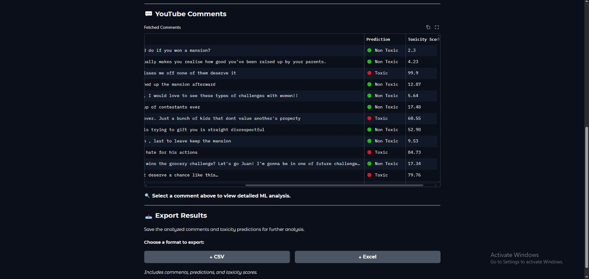
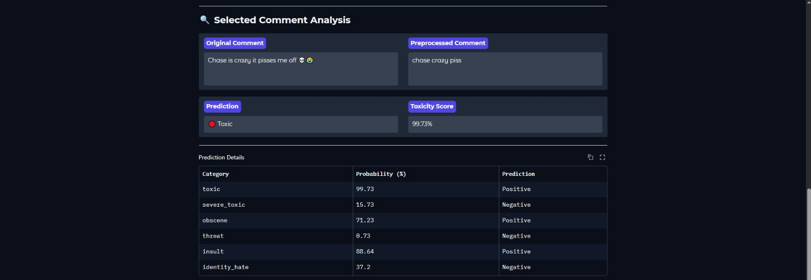

# 🛡️ AI YouTube Toxic Comment Detection System

An AI-powered **YouTube Toxic Comment Detection System** that fetches comments from a YouTube video, analyzes them using a trained Machine Learning model, identifies different types of toxic content, and presents the results through an interactive **Gradio dashboard**.

The system provides overall toxicity statistics, comment-level predictions, toxicity probabilities, detailed analysis of individual comments, probability visualization, and CSV/Excel export functionality.

---

## 🌐 Live Demo

🚀 **Live Application:**
https://ai-youtube-toxic-comment-detection-system.onrender.com/

---

## 💻 GitHub Repository

🔗 https://github.com/Hitesh-77/AI-YouTube-Toxic-Comment-Detection-System

---

# 📸 Screenshots

## Dashboard Overview



---

## YouTube Comments & Predictions



---

## Selected Comment Analysis



---

## Probability Distribution


---

# ✨ Features

* 🔗 Analyze comments directly from a YouTube video URL
* 📥 Fetch YouTube comments using the YouTube Data API
* 🤖 AI-powered multi-label toxicity detection
* 🧹 Automated NLP text preprocessing
* 📊 Interactive toxicity dashboard
* 💬 Display fetched YouTube comments in a table
* 🔍 Select individual comments for detailed analysis
* 🟢 Identify non-toxic comments
* 🔴 Identify toxic comments
* 📈 Calculate toxicity probability scores
* 🧠 Detect multiple toxicity categories
* 📊 Visualize category-wise toxicity probabilities
* 📋 Display detailed prediction results
* 📥 Export analysis results to CSV
* 📊 Export analysis results to Excel
* 🎨 Custom Gradio UI styling
* ⚡ Adjustable maximum number of comments to analyze
* 🌐 Deployed and accessible through a live web application

---

# 🧠 Toxicity Categories

The Machine Learning model performs multi-label classification across **six toxicity categories**:

| Category        | Description                      |
| --------------- | -------------------------------- |
| `toxic`         | General toxic or abusive content |
| `severe_toxic`  | Severely toxic content           |
| `obscene`       | Obscene or explicit language     |
| `threat`        | Threatening content              |
| `insult`        | Insulting or degrading content   |
| `identity_hate` | Identity-based hateful content   |

A single comment can belong to multiple categories simultaneously.

---

# 🔄 How It Works

The system follows the following pipeline:

```text
YouTube Video URL
        │
        ▼
YouTube Data API
        │
        ▼
Fetch YouTube Comments
        │
        ▼
Text Preprocessing
        │
        ├── Lowercasing
        ├── URL Removal
        ├── HTML Removal
        ├── Emoji Removal
        ├── Contraction Expansion
        ├── Punctuation Removal
        ├── Tokenization
        ├── Stopword Removal
        └── Lemmatization
        │
        ▼
Feature Engineering
        │
        ├── TF-IDF Text Features
        ├── Comment Length
        └── Word Count
        │
        ▼
Machine Learning Model
        │
        ▼
Six Toxicity Predictions
        │
        ▼
Toxicity Probabilities
        │
        ▼
Gradio Dashboard
        │
        ├── Statistics
        ├── Comment Table
        ├── Detailed Analysis
        ├── Probability Chart
        └── CSV / Excel Export
```

---

# 🤖 Machine Learning Pipeline

The system uses a trained **One-vs-Rest Logistic Regression** model for multi-label toxicity classification.

The final model is stored using **Joblib** and loaded during application execution.

### Model Architecture

```text
Input Comment
      │
      ▼
Text Preprocessing
      │
      ▼
TF-IDF Vectorization
      │
      ├───────────────┐
      │               │
      ▼               ▼
Text Features    Numerical Features
                 ├── Comment Length
                 └── Word Count
      │               │
      └───────┬───────┘
              ▼
       Feature Transformer
              │
              ▼
   One-vs-Rest Logistic Regression
              │
              ▼
      Six Probability Outputs
              │
              ▼
     Category-Specific Thresholds
              │
              ▼
       Final Predictions
```

The training pipeline uses TF-IDF features with up to **150,000 features**, combined with numerical features such as comment length and word count. The Logistic Regression classifier uses class balancing and is trained using a One-vs-Rest strategy.

---

# 🧹 NLP Preprocessing

Before a comment is passed to the Machine Learning model, it goes through several preprocessing steps:

* Convert text to lowercase
* Remove URLs
* Remove HTML tags
* Remove emojis
* Expand contractions
* Remove punctuation
* Tokenize text
* Remove stopwords
* Preserve important negation words
* Apply POS-aware lemmatization
* Reconstruct cleaned text

Example:

```text
Original:
"I don't think you're a good person!!! 😡"

        ↓

Preprocessed:
"not think good person"
```

The preprocessing pipeline is implemented using **NLTK, Regex, Contractions, and Emoji** processing.

---

# 📊 Model Input Features

The model uses both text-based and numerical features.

### Text Features

**TF-IDF (Term Frequency-Inverse Document Frequency)** is used to convert the cleaned comments into numerical text features.

### Numerical Features

Two additional features are extracted:

* Comment Length
* Word Count

These features are combined using a Scikit-learn `ColumnTransformer` before being passed to the classifier.

---

# 🎯 Prediction System

For every comment, the model generates a probability for each toxicity category.

Category-specific thresholds are then applied to convert probabilities into binary predictions.

Example:

| Category      | Probability | Threshold | Prediction  |
| ------------- | ----------: | --------: | ----------- |
| Toxic         |         92% |       60% | 🔴 Positive |
| Severe Toxic  |         41% |       80% | 🟢 Negative |
| Obscene       |         96% |       70% | 🔴 Positive |
| Threat        |         12% |       85% | 🟢 Negative |
| Insult        |         88% |       65% | 🔴 Positive |
| Identity Hate |         15% |       80% | 🟢 Negative |

The final model package stores the trained model, category labels, and optimized thresholds.

---

# 📈 Dashboard Components

## 📊 Dashboard Statistics

After analyzing a YouTube video, the dashboard displays:

* Total Comments
* Safe Comments
* Toxic Comments
* Overall Toxicity Rate

The toxicity rate is calculated based on the proportion of comments classified as toxic.

---

## 💬 YouTube Comments Table

The fetched comments are displayed with:

| Column         | Description                            |
| -------------- | -------------------------------------- |
| Username       | YouTube commenter's username           |
| Comment        | Original YouTube comment               |
| Prediction     | Toxic / Non Toxic                      |
| Toxicity Score | Highest predicted toxicity probability |

Users can select a comment from the table to view its detailed analysis.

---

# 🔍 Selected Comment Analysis

Selecting a comment provides a detailed analysis containing:

### Original Comment

The original YouTube comment fetched from the API.

### Preprocessed Comment

The cleaned version of the comment used for Machine Learning prediction.

### Prediction

The overall classification:

* 🟢 Non Toxic
* 🔴 Toxic

### Toxicity Score

The highest probability among the six toxicity categories.

### Prediction Details

The dashboard displays:

| Category      | Probability | Prediction          |
| ------------- | ----------- | ------------------- |
| Toxic         | %           | Positive / Negative |
| Severe Toxic  | %           | Positive / Negative |
| Obscene       | %           | Positive / Negative |
| Threat        | %           | Positive / Negative |
| Insult        | %           | Positive / Negative |
| Identity Hate | %           | Positive / Negative |

---

# 📊 Probability Visualization

For each selected comment, the application generates a **Toxicity Probability Distribution** chart.

The chart displays the model's probability for each toxicity category:

```text
Toxic
Severe Toxic
Obscene
Threat
Insult
Identity Hate
```

This makes it easier to understand which categories contribute most strongly to the model's prediction.

---

# 📥 Export Results

The system allows users to export the analyzed YouTube comments.

### CSV

Exports:

* Username
* Comment
* Prediction
* Toxicity Score

### Excel

Exports the same analysis in Excel format.

This makes the results suitable for further analysis, reporting, or data processing.

---

# 🔗 YouTube Data API Integration

The application uses the **YouTube Data API v3** to retrieve comments from YouTube videos.

The system supports common YouTube URL formats including:

* Standard YouTube URLs
* `youtu.be` URLs
* YouTube Shorts URLs

The application extracts the video ID and retrieves comments using the YouTube `commentThreads` API.

---

# 🔐 Environment Variables

The YouTube API key should **not** be hardcoded or committed to GitHub.

Create a `.env` file in the project root:

```env
YOUTUBE_API_KEY=your_youtube_api_key
```

The application loads the API key using `python-dotenv`.

> ⚠️ Never commit your `.env` file or expose your YouTube API key publicly.

Add the following to `.gitignore`:

```gitignore
.env
```

---

# 🛠 Tech Stack

### Programming Language

* Python

### Machine Learning

* Scikit-learn
* Logistic Regression
* One-vs-Rest Classification
* Joblib
* NumPy
* Pandas

### Natural Language Processing

* NLTK
* TF-IDF
* WordNet Lemmatization
* POS Tagging
* Regex
* Contractions
* Emoji Processing

### YouTube Integration

* YouTube Data API v3
* Google API Client
* Python-dotenv

### Web Interface

* Gradio
* Custom CSS

### Visualization

* Matplotlib

### Data Processing

* Pandas
* NumPy

---

# 📂 Project Structure

```text
AI-YouTube-Toxic-Comment-Detection-System/
│
├── app.py
├── predict.py
├── preprocessing.py
├── youtube_comments.py
├── model7.ipynb
├── style.css
├── train.csv
├── best_lr_toxic_comment_model.pkl
├── requirements.txt
├── .gitignore
├── .env
└── README.md
```

> **Note:** `.env` should remain local and must not be committed to GitHub.

---

# 🚀 Installation

## 1. Clone the Repository

```bash
git clone https://github.com/Hitesh-77/AI-YouTube-Toxic-Comment-Detection-System.git
```

## 2. Move into the Project Directory

```bash
cd AI-YouTube-Toxic-Comment-Detection-System
```

## 3. Create a Virtual Environment

```bash
python -m venv venv
```

Activate the environment.

### Windows

```bash
venv\Scripts\activate
```

### macOS / Linux

```bash
source venv/bin/activate
```

## 4. Install Dependencies

```bash
pip install -r requirements.txt
```

## 5. Configure YouTube API Key

Create a `.env` file:

```env
YOUTUBE_API_KEY=your_youtube_api_key
```

## 6. Run the Application

```bash
python app.py
```

The Gradio application will start locally.

---

# ☁️ Deployment

The application is deployed as a live web application and can be accessed here:

https://ai-youtube-toxic-comment-detection-system.onrender.com/

The application can also be deployed using platforms that support Python and Gradio applications.

For deployment, make sure to configure:

```text
YOUTUBE_API_KEY
```

as an environment variable instead of committing the API key to the repository.

---

# 🧪 Example Workflow

1. Open the application.
2. Paste a YouTube video URL.
3. Select the maximum number of comments to analyze.
4. Click **Fetch & Analyze Comments**.
5. The application retrieves comments from YouTube.
6. Each comment is processed through the NLP pipeline.
7. The Machine Learning model predicts toxicity categories.
8. Dashboard statistics are generated.
9. Select any comment to inspect its detailed prediction.
10. View the toxicity probability distribution.
11. Export the results as CSV or Excel.

---

# 📌 Limitations

* The system depends on the availability of the YouTube Data API.
* YouTube API quotas may limit the number of comments that can be retrieved.
* The model is primarily designed for English-language comments.
* Machine Learning predictions may contain false positives or false negatives.
* Toxicity classification should be treated as an automated prediction rather than a definitive moderation decision.

---

# 🚀 Future Improvements

* 🌍 Support for multiple languages
* 🧠 Transformer-based models such as BERT/RoBERTa
* 📊 More advanced toxicity analytics
* 📈 Historical toxicity tracking
* 🔎 Comment search and filtering
* 📊 Category-wise toxicity statistics
* 📉 Model performance dashboard
* 🧪 Model comparison
* 🔥 Explainable AI using SHAP
* ⚡ Batch processing improvements
* 👤 User/channel-level toxicity analysis
* 💾 Database integration for historical results
* 🎨 Additional UI themes
* 🚀 Improved deployment and scalability

---

# 👨‍💻 Author

**Hitesh Kumar**

BCA Student | AI & Machine Learning Enthusiast

### GitHub

https://github.com/Hitesh-77

---

# ⭐ Support

If you found this project useful or interesting, consider giving the repository a ⭐ on GitHub.

Your support is appreciated! ❤️
